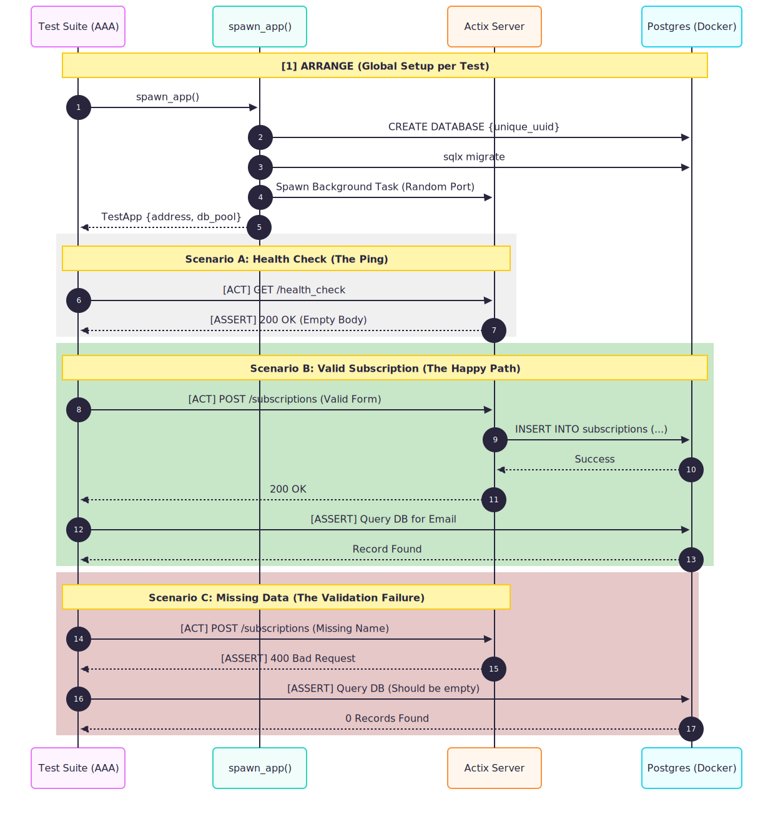

# Zero2Prod: A Production-Ready Rust Newsletter API

A hands-on implementation of a cloud-native newsletter service built with Rust. This project focuses on professional engineering patterns, including strong type safety, asynchronous runtimes, and hermetic integration testing.

## 🗺 Roadmap

- [x] **Chapter 3:** Basic Sign-up (Postgres + Actix)
- [ ] **Chapter 4:** Telemetry & Structured Logging (Tracing)
- [ ] **Chapter 5:** Dockerization & Deployment
- [ ] **Chapter 6:** Email Delivery (Postmark Integration)

## 🏗 System Architecture of Ch. 3

<details>
The following diagrams illustrate the static structure, dynamic behavior, and data flow of the system.

### 1. Class Structure (Anatomy)

This map shows the relationship between configuration DTOs, the application state, and the core server modules.


### 2. Integration Test Lifecycle (Behavior)

Our test suite utilizes **Hermetic Testing** with **Ephemeral Infrastructure**. Each test case spawns its own isolated logic and a dedicated logical database instance.



### 3. Dependency & Data Flow (Plumbing)

This graph tracks the lifecycle of a request, showing how the database connection pool is injected into the Actix-web runtime via `web::Data`.



## </details>

---

## 🚀 The Technical Stack

- **Web Framework:** [Actix-web](https://actix.rs/) (Multi-threaded worker model)
- **Database:** [PostgreSQL](https://www.postgresql.org/) with [SQLx](https://github.com/launchbadge/sqlx) (Compile-time verified queries)
- **Runtime:** [Tokio](https://tokio.rs/) (Asynchronous event loop)
- **Configuration:** [Config](https://github.com/mehcode/config-rs) (Hierarchical environment management)
- **Serialization:** [Serde](https://serde.rs/) (Declarative data mapping)

## 🛠 Project Structure

- **`src/main.rs`**: The Binary Entry Point (Production Runtime).
- **`src/lib.rs`**: The Crate Root (Module exposure and shared logic).
- **`src/startup.rs`**: The application bootstrapper and socket handover.
- **`src/routes/`**: Endpoint handlers (Health Check and Subscriptions).
- **`src/configuration.rs`**: Type-safe settings and URI builders.

## 🧪 Running the Project

### 1. Prerequisites

- [Rust](https://www.rust-lang.org/) (2024 Edition)
- [Docker](https://www.docker.com/) (For PostgreSQL)
- [sqlx-cli](https://github.com/launchbadge/sqlx)
- [cargo-watch](https://github.com/watchexec/cargo-watch) (Optional: for hot-reloading)

### 2. Setup Database

```bash
./scripts/init_db.sh
```

### 3. Run Tests

We follow the AAA (Arrange, Act, Assert) pattern for all integration tests:

```zsh
cargo test
```

### 4. Run Application

```zsh
cargo run
```

To enable hot-reloading (recompiles automatically on file save):

```zsh
cargo watch -x check -x test -x run
```

Developed as part of the ZeroToProduction in Rust curriculum.
